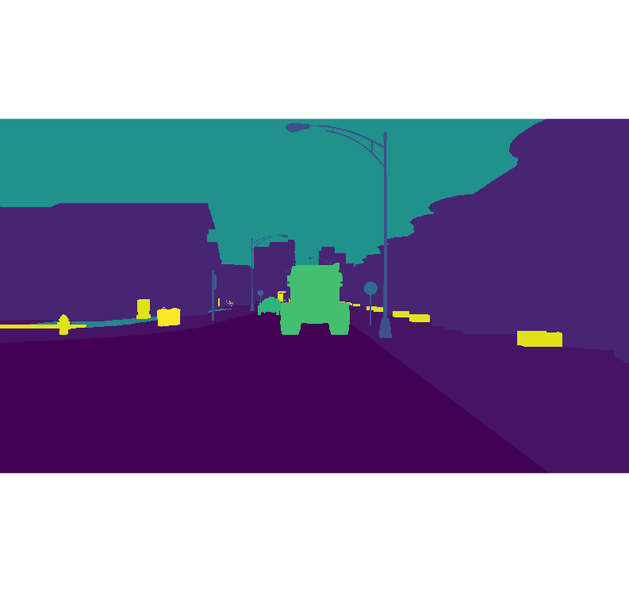
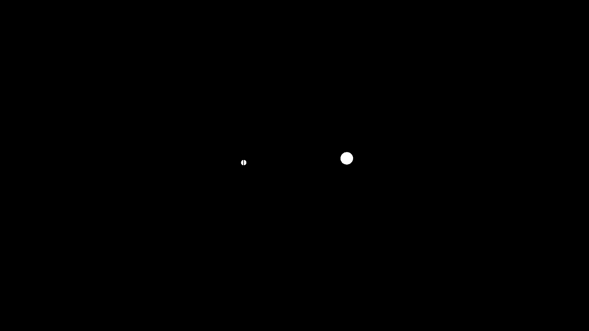
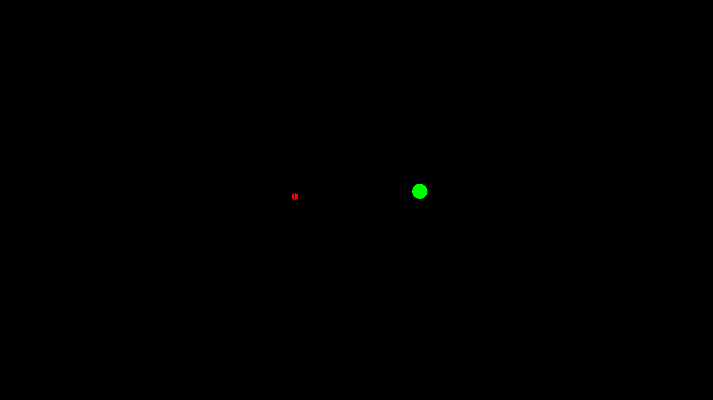
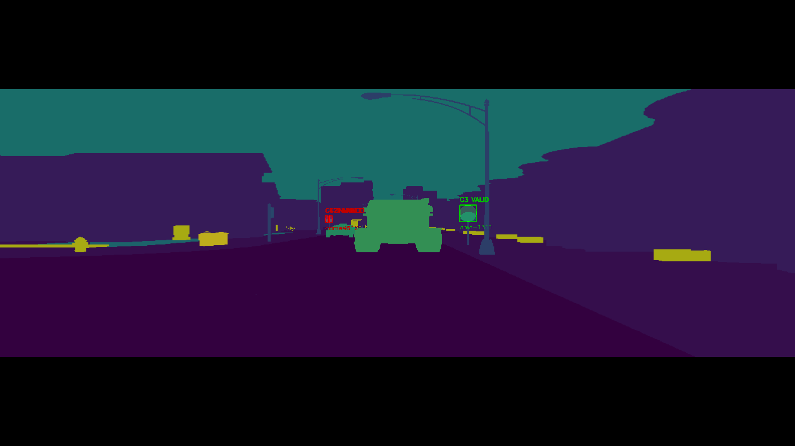

# Detecção de Componentes com Grafos

---

**Disciplina:** FGA0030 - Estruturas de Dados e Algoritmos II  
**Tema:** Grafos

---

## Integrantes

<div align="center">
  <a href="https://github.com/thalesgvl">
    
  </a>
  <a href="https://github.com/marcomarquesdc">
    
  </a>
</div>

<div align="center">

| Matrícula   | Aluno          |
|-------------|----------------|
| 20/2017147  | Thales Germano |
| 21/1062197  | Marco Marques  |

</div>

---

## Sobre

Este projeto processa máscaras de segmentação armazenadas em arquivos `.h5` e identifica componentes conectados utilizando uma estrutura de grafo de pixels. Cada pixel válido é tratado como um nó, e os vizinhos formam as arestas. A partir disso, o algoritmo usa busca em largura (BFS) para encontrar os componentes conectados.

O objetivo principal é classificar cada componente como:

- **de frente**: quando a placa está bem orientada;
- **virada**: quando a placa está inclinada ou com formato menos adequado.

Na saída visual:

- **verde** representa o estado `de frente`;
- **vermelho** representa o estado `virada`.

---

## Estrutura do Projeto

```text
G42_Grafos_EDA2-2026.1/
├── main.py
├── README.md
├── h5_files/
│   ├── 0080.h5
│   ├── 0080.png
│   ├── 0100.h5
│   └── 0100.png
├── outputs_flood_fill/
│   ├── 0080/
│   └── 0100/
└── images/
```

---

## Funcionamento

O fluxo do projeto é o seguinte:

```text
Arquivo .h5
    ↓
Leitura do dataset labels
    ↓
Filtro do ID desejado
    ↓
Geração da máscara binária
    ↓
Busca por componentes conectados com BFS
    ↓
Classificação em de frente ou virada
    ↓
Geração das imagens de saída
```

O ID filtrado é definido no código como:

```python
ID_FILTRAR = 8
```

---

## Relação com Grafos

A imagem é interpretada como uma malha de pixels conectados.

```text
pixel válido     -> nó
pixel vizinho    -> aresta
região conectada -> componente
BFS              -> percurso no grafo
```

A BFS percorre todos os pixels ligados entre si e agrupa esses pixels em um mesmo componente.

---

## Classificação Visual

A classificação é feita com base na forma do componente detectado. Quando o componente apresenta uma proporção mais adequada, ele é marcado como de frente; caso contrário, como virada.

Na imagem gerada:

- o retângulo é desenhado com a cor correspondente;
- é exibido um rótulo com a categoria e a área do componente;
- um marcador visual indica a decisão final.

---

## Imagens Geradas

As imagens de saída são geradas automaticamente quando o script é executado.

### Exemplo 1: arquivo 0080









---

## Como Executar

Instale as dependências:

```bash
pip install opencv-python numpy h5py
```

Coloque os arquivos `.h5` na pasta:

```text
h5_files/
```

Depois execute:

```bash
python main.py
```

No Linux ou WSL, se necessário:

```bash
python3 main.py
```

---

## Saída no Terminal

Durante a execução, o programa exibe informações como:

```text
Arquivo processado: 0080.h5
Componentes encontrados para id=8: 3
Resultados salvos em: outputs_flood_fill/0080
```

---

## Conclusão

O projeto mostra uma aplicação prática de grafos em processamento de imagens. A máscara é transformada em um grafo de pixels, os componentes conectados são encontrados com BFS e, ao final, cada componente é classificado visualmente como `de frente` ou `virada`.


---

## Apresentação

<div align="center">
  <a href="https://youtu.be/8T84RpAZZa0" target="_blank">
    <strong>▶️ Clique aqui para assistir à apresentação no YouTube</strong>
  </a>
</div>

<br>

<font size="3">
  <p style="text-align: center">
    Autores: 
    <a href="https://github.com/thalesgvl">Thales Germano Vargas Lima</a> & 
    <a href="https://github.com/marcomarquesdc">Marco Marques</a>
  </p>
</font>
